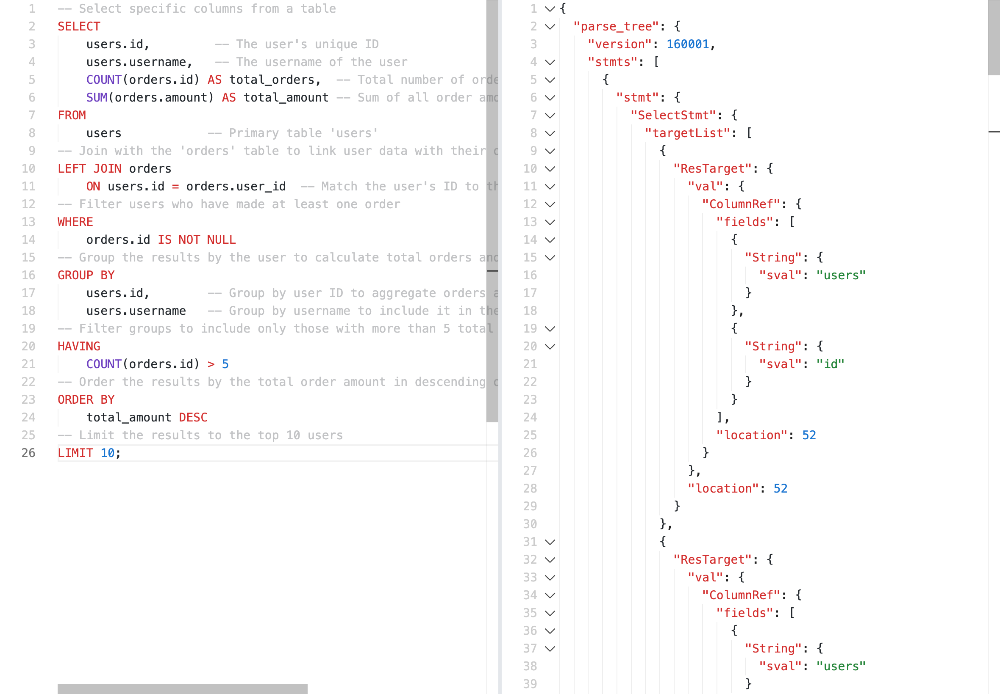

# pg-query-ast-explorer

A tool for visualizing the Abstract Syntax Tree (AST) of PostgreSQL queries in real-time. With an intuitive editor and real-time parsing, you can explore the structure of your PostgreSQL queries effortlessly.

## Demo

Check out the live demo: [pg-query-ast-explorer Demo](https://pg-query-ast-explorer.vercel.app/)

## How It Works

- **PostgreSQL AST Parsing:** The tool converts PostgreSQL query strings into an AST, allowing users to explore the structure of their SQL queries.
- **Interactive Editor:** Provides a real-time, easy-to-use code editor with syntax highlighting and smooth query visualization.

## Tools Used

- [`libpg-query-wasm`](https://github.com/pganalyze/pg-query-emscripten): Used to parse PostgreSQL queries into an AST using WebAssembly.
- [`shiki`](https://github.com/shikijs/shiki): Used for syntax highlighting in the code editor.
- [`monaco-editor`](https://github.com/microsoft/monaco-editor): Used for the code editor

## Contributing

Contributions are welcome! Feel free to open issues or submit pull requests.

## Sponsors

	

